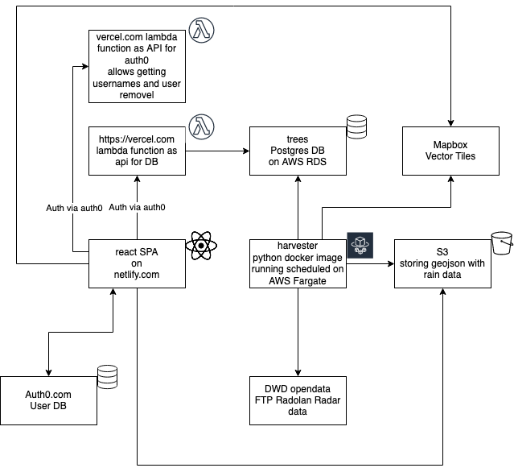

# giessdenkiez.de  

[](https://app.netlify.com/sites/internetoftrees/deploys)    

Source repo for [giessdenkiez.de](https://www.giessdenkiez.de) project by Technologiestiftung Berlin and CityLAB Berlin.  

## Used Resources

This is a short list of the things that are needed for running this project yourselves.

- Netlify.com for hosting
- vercel.com for serverless functions to interact with the database
- AWS RDS Postgres
- auth0.com + vercel.com for user management
- AWS Fargate python script in docker for rain data aggreagation from Deutsche Wetterdientst (DWD) + Mapbox API for creating vector tiles for mobile

These are the related repos:  

- [React frontend (this is here)](https://github.com/technologiestiftung/giessdenkiez-de)
- [vercel.com DB API](https://github.com/technologiestiftung/giessdenkiez-de-postgres-api)
- [vercel.com Auth0 API (currently only for username and user deletion)](https://github.com/technologiestiftung/tsb-trees-api-user-management)
- [AWS Fargate Service for DWD rain data and Mapbox API vector tiles](https://github.com/technologiestiftung/giessdenkiez-de-dwd-harvester) 

Below is a rough sketch of the architecture:



## Development

To get the map tiles loaded you need to create a `.env` file and add the following:

```env
# mapbox token
API_KEY=****************
# auth0.com 
AUTH0_DOMAIN=***********
AUTH0_CLIENT_ID=********
AUTH0_AUDIENCE=*********
# url to where your user management api
# is deployed (here at vercel.com)
# https://github.com/technologiestiftung/tsb-trees-api-user-management
USER_DATA_API_URL=******
# url where your postgres api is deployed
# currently vercel.com
# https://github.com/technologiestiftung/giessdenkiez-de-postgres-api 
API_ENDPOINT_DEV=*******
API_ENDPOINT_PROD=******
```

The environment variable `BUILD_TARGET` 

```env
BUILD_TARGET=DEMO
# or …=DEFAULT
```

could also be defined in the `.env` file. It is better though to define them in the `netlify.toml` in the build contexts or in the npm-scripts. You can use this to build the demo mode.

Make sure to set your `NODE_ENV` to either `test`, `development` or `production`

---

Start the project via  

```bash
npm start
```

## Deployment

To deploy the frontend we use netlify.com

Take a look at the `netlify.toml` for the the used commands to deploy it. Make sure to set all the variables you have in your `.env` file in the environment section of your projects build & deploy settings.


## Demo Mode

The purpose of the demo mode (created if you set the env variable `BUILD_TARGET=DEMO`) is to run this application in the exhibition of the CityLAB Berlin. In this mode all requests to the api get mocked responses except for the get tree by id and get all trees. It uses the [msw (Mock Service Worker)](https://github.com/mswjs/msw) module underneath to handle API requests and does a module replacement for the [auth0-spa-js](https://github.com/auth0/auth0-spa-js) library wrapper with webpack.  


To start the DEMO mode run.

```bash
npm run demo
```
<!-- trigger deploy 2020-08-05 12:55:46 :rocket: -->