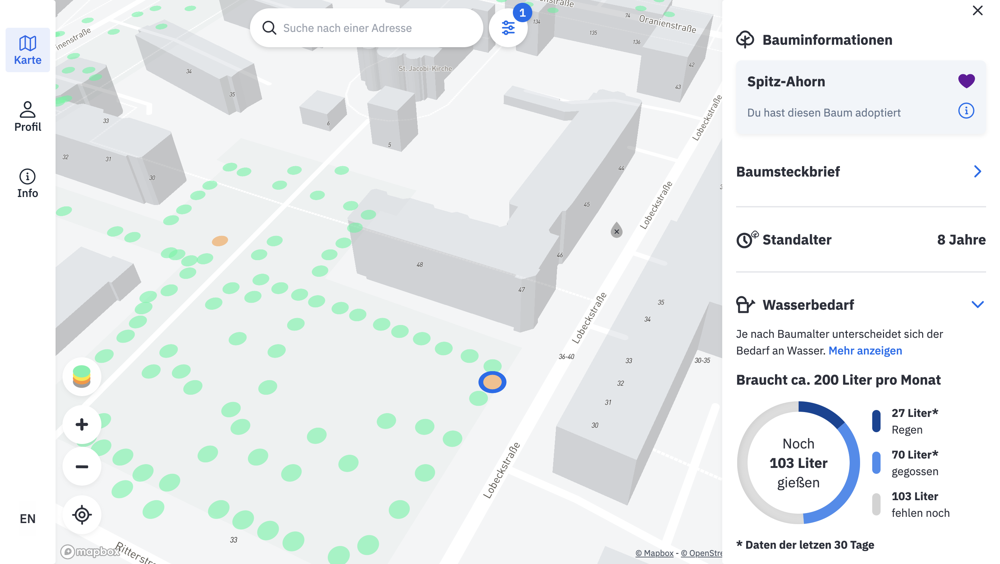

[](https://app.netlify.com/sites/internetoftrees/deploys)    

# [](https://www.giessdenkiez.de)

---



## About [_Gieß den Kiez_](https://www.giessdenkiez.de)

The consequences of climate change, especially the dry and hot summers, are putting a strain on Berlin's ecosystem. Our urban trees are drying out and suffering long-term damage: In recent years, more and more trees have had to be cut down and their lifespan is declining. In the meantime, the population is regularly called upon to help, but largely uncoordinated. [_Gieß den Kiez_](https://www.giessdenkiez.de) is was made to change that and enable coordinated citizen* participation in the irrigation of urban trees. This project was made by the [Technologiestiftung Berlin](https://www.technologiestiftung-berlin.de/de/startseite/) and the [CityLAB Berlin](https://www.citylab-berlin.org/).

---

## Repositories

This project is composed of multiple repositories:

- [React frontend (this is here)](https://github.com/technologiestiftung/giessdenkiez-de)
- [AWS RDS Provisioning](https://github.com/technologiestiftung/giessdenkiez-de-aws-rds-terraform)
- [AWS S3 Provisioning](https://github.com/technologiestiftung/giessdenkiez-de-aws-s3-terraform)
- [Database API](https://github.com/technologiestiftung/giessdenkiez-de-postgres-api)
- [User Management API](https://github.com/technologiestiftung/tsb-trees-api-user-management)
- [DWD Harvester](https://github.com/technologiestiftung/giessdenkiez-de-dwd-harvester)
- [OSM Harvester](https://github.com/technologiestiftung/giessdenkiez-de-osm-pumpen-harvester)

---

## Documentation

You can find the projects documentation in this repos [wiki](https://github.com/technologiestiftung/giessdenkiez-de/wiki).

<!-- ---


## Demo Mode

The purpose of the demo mode (created if you set the env variable `BUILD_TARGET=DEMO`) is to run this application in the exhibition of the CityLAB Berlin. In this mode all requests to the api get mocked responses except for the get tree by id and get all trees. It uses the [msw (Mock Service Worker)](https://github.com/mswjs/msw) module underneath to handle API requests and does a module replacement for the [auth0-spa-js](https://github.com/auth0/auth0-spa-js) library wrapper with webpack.  


To start the DEMO mode run.

```bash
npm run demo
``` -->
