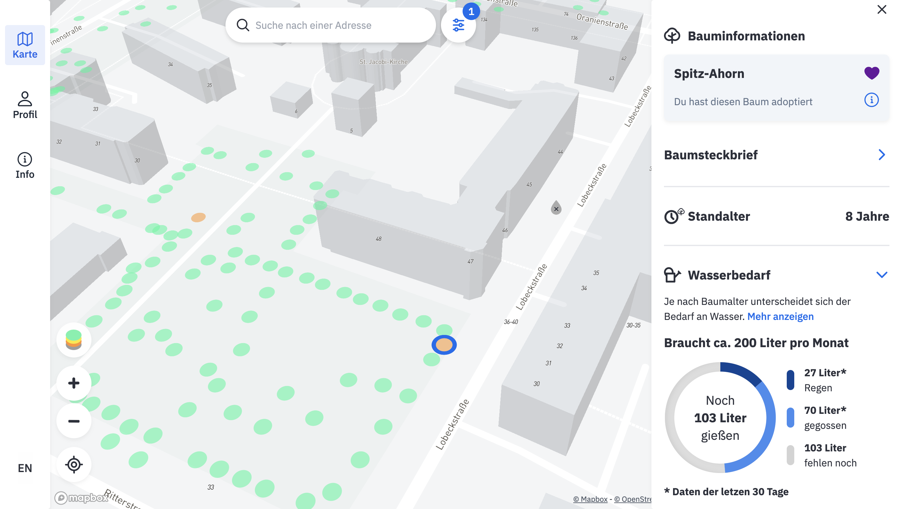

  

<!-- ALL-CONTRIBUTORS-BADGE:START - Do not remove or modify this section -->

<!-- ALL-CONTRIBUTORS-BADGE:END -->

# 

## About [_Gieß den Kiez_](https://www.giessdenkiez.de)

The consequences of climate change, especially the dry and hot summers, are putting a strain on city’s green infrastructure. [Gieß den Kiez](https://www.giessdenkiez.de) is an interactive platform which was launched in May 2020 to help Berlin’s urban trees and support the city in watering the trees through the voluntary work of civil society. The map depicts almost all of Berlin’s street and park trees with information such as water requirements, age and species and invites all citizens to participate in the watering of our endangered tree population. Citizens can find out about the water requirements of trees in their neighbourhood, create a profile, adopt trees and mark them as ‘watered’ within the app. And much more.

Gieß den Kiez is an open source project by the [Technologiestiftung Berlin](https://www.technologiestiftung-berlin.de/) and the [CityLAB Berlin](https://citylab-berlin.org/de/start/). Multiple other cities have already successfully adapted it. If your city wishes an individual platform as well, our experienced team is happy to support with the technical implementation and the establishment of a watering community. You can find all further information on our additional services at [DeineStadtGießt](https://deinestadt.giessdenkiez.de/).

## Repositories

This project is composed of multiple repositories:

- [React frontend (this is here)](https://github.com/technologiestiftung/giessdenkiez-de)
- [Database API](https://github.com/technologiestiftung/giessdenkiez-de-postgres-api)
- [DWD Harvester](https://github.com/technologiestiftung/giessdenkiez-de-dwd-harvester)
- [OSM Harvester](https://github.com/technologiestiftung/giessdenkiez-de-osm-pumpen-harvester)
- [Tree Data Import](https://github.com/technologiestiftung/giessdenkiez-de-tree-data)

## Documentation

To setup Gieß den Kiez locally or in production, follow the development setup guide at [README_DEV.md)](./README_DEV.md).

You can find a higher level project documentation in this repos [wiki](https://github.com/technologiestiftung/giessdenkiez-de/wiki).

## Contributors ✨

Thanks goes to these wonderful people ([emoji key](https://allcontributors.org/docs/en/emoji-key)):

<!-- ALL-CONTRIBUTORS-LIST:START - Do not remove or modify this section -->
<!-- prettier-ignore-start -->
<!-- markdownlint-disable -->
<table>
  <tbody>
    <tr>
      <td align="center" valign="top" width="14.28%"><a href="https://github.com/JensWinter"> <b>Jens Winter-Hübenthal</b></a> <a href="https://github.com/technologiestiftung/giessdenkiez-de/commits?author=JensWinter" title="Code">💻</a></td>
      <td align="center" valign="top" width="14.28%"><a href="https://fabianmoronzirfas.me/"> <b>Fabian Morón Zirfas</b></a> <a href="https://github.com/technologiestiftung/giessdenkiez-de/commits?author=ff6347" title="Code">💻</a></td>
      <td align="center" valign="top" width="14.28%"><a href="https://github.com/vogelino"> <b>Lucas Vogel</b></a> <a href="https://github.com/technologiestiftung/giessdenkiez-de/commits?author=vogelino" title="Code">💻</a></td>
      <td align="center" valign="top" width="14.28%"><a href="https://github.com/dnsos"> <b>Dennis Ostendorf</b></a> <a href="https://github.com/technologiestiftung/giessdenkiez-de/commits?author=dnsos" title="Code">💻</a></td>
      <td align="center" valign="top" width="14.28%"><a href="https://github.com/fdnklg"> <b>Fabian</b></a> <a href="https://github.com/technologiestiftung/giessdenkiez-de/commits?author=fdnklg" title="Code">💻</a></td>
      <td align="center" valign="top" width="14.28%"><a href="https://github.com/Jaszkowic"> <b>Jonas Jaszkowic</b></a> <a href="https://github.com/technologiestiftung/giessdenkiez-de/commits?author=Jaszkowic" title="Code">💻</a></td>
      <td align="center" valign="top" width="14.28%"><a href="https://github.com/julizet"> <b>Julia Zet</b></a> <a href="https://github.com/technologiestiftung/giessdenkiez-de/commits?author=julizet" title="Code">💻</a></td>
    </tr>
    <tr>
      <td align="center" valign="top" width="14.28%"><a href="https://github.com/lucasoeth"> <b>lucasoeth</b></a> <a href="https://github.com/technologiestiftung/giessdenkiez-de/commits?author=lucasoeth" title="Code">💻</a></td>
      <td align="center" valign="top" width="14.28%"><a href="https://github.com/raphael-arce"> <b>Raphael.A</b></a> <a href="https://github.com/technologiestiftung/giessdenkiez-de/commits?author=raphael-arce" title="Code">💻</a></td>
      <td align="center" valign="top" width="14.28%"><a href="http://www.sebastianmeier.eu/"> <b>Sebastian Meier</b></a> <a href="https://github.com/technologiestiftung/giessdenkiez-de/commits?author=sebastian-meier" title="Code">💻</a></td>
      <td align="center" valign="top" width="14.28%"><a href="https://github.com/bnjmnsbl"> <b>Benjamin Seibel</b></a> <a href="https://github.com/technologiestiftung/giessdenkiez-de/commits?author=bnjmnsbl" title="Code">💻</a></td>
      <td align="center" valign="top" width="14.28%"><a href="https://github.com/Lisa-Stubert"> <b>Lisa-Stubert</b></a> <a href="https://github.com/technologiestiftung/giessdenkiez-de/commits?author=Lisa-Stubert" title="Code">💻</a></td>
      <td align="center" valign="top" width="14.28%"><a href="https://github.com/donni106"> <b>Daniel</b></a> <a href="https://github.com/technologiestiftung/giessdenkiez-de/commits?author=donni106" title="Code">💻</a></td>
      <td align="center" valign="top" width="14.28%"><a href="https://github.com/maximilianpalm"> <b>Max</b></a> <a href="https://github.com/technologiestiftung/giessdenkiez-de/commits?author=maximilianpalm" title="Code">💻</a></td>
    </tr>
    <tr>
      <td align="center" valign="top" width="14.28%"><a href="http://annaeschenbacher.com"> <b>aeschi</b></a> <a href="https://github.com/technologiestiftung/giessdenkiez-de/commits?author=aeschi" title="Code">💻</a> <a href="#design-aeschi" title="Design">🎨</a></td>
      <td align="center" valign="top" width="14.28%"><a href="http://www.davidpinheiro.dev"> <b>David Pinheiro</b></a> <a href="https://github.com/technologiestiftung/giessdenkiez-de/commits?author=Mozzzaic" title="Code">💻</a> <a href="#a11y-Mozzzaic" title="Accessibility">️️️️♿️</a></td>
    </tr>
  </tbody>
</table>

<!-- markdownlint-restore -->
<!-- prettier-ignore-end -->

<!-- ALL-CONTRIBUTORS-LIST:END -->

This project follows the [all-contributors](https://github.com/all-contributors/all-contributors) specification. Contributions of any kind welcome!
